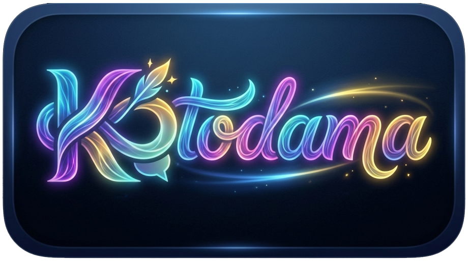

<div align="center">



# Kotodama · Ai Prompt Builder

**All your AI assistants in one desktop app, with prompt auto-send. Fast, and fully local.**

[](../../releases)
[](../../releases)
[](../../stargazers)
[](LICENSE)


`ChatGPT` · `Claude` · `Gemini` · `Grok` · `Perplexity` · `Qwen` · `DeepSeek` · `Z.ai`

🔗 **[kotodama.kuramalab.net](https://kotodama.kuramalab.net)** — if you like it, leave a ⭐, it really helps.

</div>

---

## 🎬 Demo (video)

<div align="center">

[](https://youtu.be/HF72ZmiMUqA)

▶️ **[Watch on YouTube](https://youtu.be/HF72ZmiMUqA)**

</div>

---

## ✨ What is Kotodama

Kotodama is a **free, open-source** desktop app that brings the main AI assistants (ChatGPT, Claude, Gemini,
Grok, Perplexity, Qwen, DeepSeek, Z.ai…) into a **single window**, with **automatic prompt sending**. Write the
prompt, pick the provider, send. It runs **entirely on your machine**: no account, no telemetry, your data never
leaves your computer.

**Kotodama** (言霊) is a Japanese concept: the *spiritual power of words* — the idea that words can shape reality.
Hence the project's promise: **give your words power**.

## ⬇️ Download (free)

Grab the installer from the **[Releases](../../releases)** page — no account, no sign-up:

- **Windows** — `.msi` / `.exe` (NSIS)
- **macOS** — `.dmg` *(experimental)*
- **Linux** — `.deb` / `.AppImage` *(experimental)*

> ⚠️ Builds are not signed with a certificate: on first launch Windows SmartScreen / macOS Gatekeeper may show a
> warning. It's normal for an open-source project — choose "Run anyway".

## 🔒 Privacy

Kotodama has no backend, collects no data and tracks nothing: settings and recipes stay on your computer; the AI
providers' logins live in your local profile. It's open source, so you can verify it.
Details: <https://kotodama.kuramalab.net/privacy.php>

## 🛠️ Build from source

Prerequisites: **Node.js**, **Rust**, and the [Tauri prerequisites](https://tauri.app/start/prerequisites/) for
your OS.

```bash
git clone https://github.com/Michel-IT/Kotodama
cd Kotodama/desktop
npm install
npm run tauri dev      # run locally
npm run tauri build    # produce installers
```

The release installers are built by GitHub Actions (`.github/workflows/release-tauri.yml`) from **this same
source** and published on the Releases page — nothing hidden.

## 🤝 Contributing

Issues and pull requests are welcome. Open an issue to discuss bigger changes first. By contributing you agree to
license your contribution under GPL-3.0.

## 📄 License & Trademark

- **Code**: [GPL-3.0](LICENSE). You're free to use, study, modify and redistribute it; derivative works must stay
  open under the same license.
- **Trademark**: the name **"Kotodama"**, **"KuramaLab"** and the logos are **not** covered by the code license.
  Forks and derivatives must use a **different name and branding** and may not imply endorsement.

---

<div align="center">

<a href="https://kotodama.kuramalab.net"></a>

A **KuramaLab** project · distributed free as open-source software.

</div>
